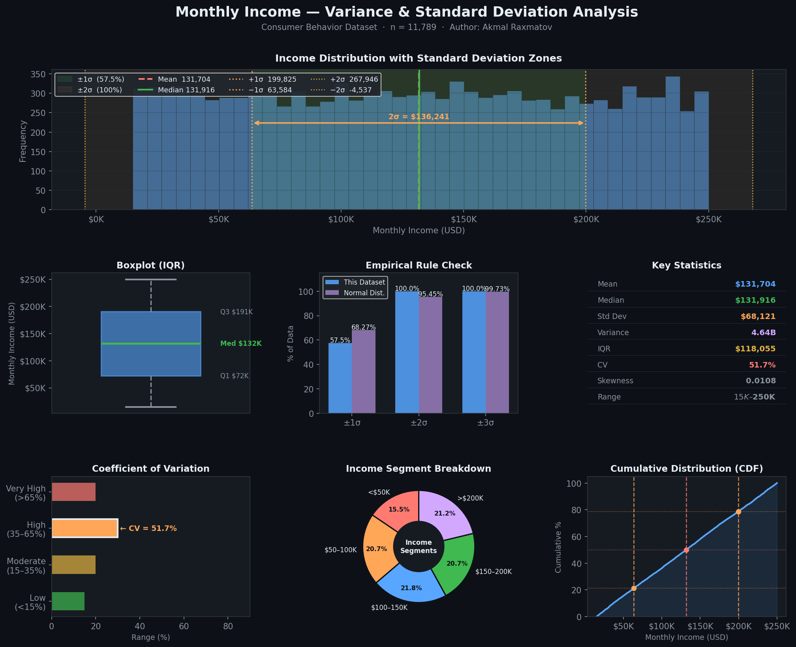

# 📊 Consumer Behavior: Variance & Standard Deviation
### Measuring Income Dispersion Across 11,789 Consumers

<div align="center">


**Author:** Akmal Raxmatov &nbsp;|&nbsp; **Dataset:** 11,789 records · 25 features &nbsp;|&nbsp; **Status:** ✅ Complete

</div>

---

## 🎯 Project Overview

This project goes beyond central tendency to explore **how spread out** income data is — the key question in economic inequality analysis, risk modeling, and consumer segmentation.

Using Variance, Standard Deviation, IQR, and the Coefficient of Variation, we dissect the income distribution of 11,789 consumers and test whether it follows the **Empirical Rule** of a normal distribution.

> *"The mean tells you where the center is. The standard deviation tells you how much the data disagrees with that center."*

---

## 📐 Statistical Concepts Covered

| Measure | Formula | Purpose |
|:---|:---:|:---|
| **Variance** | $s^2 = \frac{\sum(x_i - \bar{x})^2}{n-1}$ | Average squared distance from the mean |
| **Std Deviation** | $s = \sqrt{s^2}$ | Spread in original units (USD) |
| **IQR** | $Q_3 - Q_1$ | Spread of the middle 50% — outlier resistant |
| **CV** | $\frac{s}{\bar{x}} \times 100\%$ | Relative spread, comparable across datasets |
| **Skewness** | $g_1 = \frac{\sum(x_i-\bar{x})^3}{(n-1)s^3}$ | Distribution symmetry |
| **Kurtosis** | $g_2 = \frac{\sum(x_i-\bar{x})^4}{(n-1)s^4} - 3$ | Tail heaviness vs. normal curve |

---

## 🛠️ Tech Stack

| Library | Purpose |
|---|---|
| `pandas` | Data loading, cleaning, aggregation |
| `numpy` | Array operations, empirical rule calculations |
| `matplotlib` | All 7 chart panels |
| `jupyter` | Interactive notebook environment |

---

## 📁 Project Structure

```
consumer-behavior-analysis/
│
├── data/
│   └── data.csv                          # Raw dataset (11,789 × 25)
│
├── notebooks/
│   └── dispersiya_standart_ogish.ipynb   # Main analysis notebook
│
├── visuals/
│   └── income_dispersion.png             # 7-panel visualization
│
├── requirements.txt
└── README.md
```

---

## 📊 Results at a Glance

| Metric | Value |
|:---|---:|
| **Mean Income** | $131,704 |
| **Median Income** | $131,916 |
| **Standard Deviation** | $68,121 |
| **Variance** | $4,640,433,404 |
| **IQR** | $118,055 |
| **Coefficient of Variation** | 51.7% |
| **Skewness** | 0.0108 |
| **Kurtosis** | −1.196 |
| **Range** | $15,005 – $249,989 |
| **Outliers (±3σ)** | 0 |

---

## 🔬 Analysis Walkthrough

### Step 1 — Load & inspect

```python
import pandas as pd
import numpy as np

data = pd.read_csv('data/data.csv')
inc  = data['monthly_income'].dropna()

print(f"Records: {len(inc):,}")   # 11,789
```

### Step 2 — Compute dispersion

```python
std_val = inc.std()    # $68,121  (sample std, ddof=1)
var_val = inc.var()    # 4,640,433,404
cv      = (std_val / inc.mean()) * 100   # 51.7%
iqr     = inc.quantile(0.75) - inc.quantile(0.25)   # $118,055
```

### Step 3 — Verify the Empirical Rule

```python
within_1s = ((inc >= mean - std) & (inc <= mean + std)).mean() * 100
# Result: 57.5%  (expected for normal: 68.27%)
```

> The deviation from 68.27% is a key finding — it tells us the distribution is **platykurtic** (flatter than normal), not a true bell curve.

### Step 4 — Visualize (7-panel chart)

```python
# See full code in: notebooks/dispersiya_standart_ogish.ipynb
# Generates: visuals/income_dispersion.png
```

---

## 📈 Visualization

The notebook produces a **7-panel dark-theme analysis chart:**

| Panel | What It Shows |
|---|---|
| **Main Histogram** | Full distribution with ±1σ and ±2σ shaded zones |
| **Boxplot** | IQR, Q1, Q3, median, and whiskers |
| **Empirical Rule** | Actual vs. expected coverage at ±1σ, ±2σ, ±3σ |
| **Stats Card** | All key metrics in one glance |
| **CV Gauge** | Where this dataset sits on the dispersion spectrum |
| **Income Segments** | Donut chart: % in each $50K income bracket |
| **CDF** | Cumulative distribution with mean and ±1σ markers |



---

## 💡 Key Findings

**1. Near-perfect symmetry** — Skewness of 0.0108 ≈ 0. Income is distributed almost identically above and below the mean. This is rare in real income data.

**2. High dispersion, zero outliers** — CV of 51.7% signals a very heterogeneous group, yet no one falls beyond ±3σ. The spread is *organic and wide*, not driven by extremes.

**3. Platykurtic distribution** — Kurtosis of −1.196 means flatter-than-normal tails. Data spreads broadly and uniformly; it does not cluster sharply around the mean.

**4. Empirical Rule deviation** — 57.5% within ±1σ vs. 68.27% expected confirms the flat, uniform shape. This matters for risk modeling: assuming normality here would overestimate the predictability of income.

**5. Wide economic range** — IQR of $118,055 across a $15K–$250K range means a "typical consumer" strategy would miss the majority of this population. Segmentation by income tier is essential.

---

## 🚀 How to Run

```bash
# Clone
git clone https://github.com/thed700/Consumer_behavior_analysis
cd consumer-behavior-analysis

# Install dependencies
pip install -r requirements.txt

# Launch
jupyter notebook notebooks/dispersiya_standart_ogish.ipynb
```

---

## 📦 requirements.txt

```
pandas>=2.0.0
numpy>=1.24.0
matplotlib>=3.7.0
jupyter>=1.0.0
```

---

## 🔭 Next Steps

- [ ] Compare dispersion across `city_tier` groups (Tier 1 vs 2 vs 3)
- [ ] Correlation matrix: does income predict `avg_online_spend`?
- [ ] Income decile segmentation with labeled percentiles
- [ ] Build on top of [central tendency analysis](../central-tendency/) notebook

---

## 👤 Author

**Akmal Raxmatov**
- 📍 Uzbekistan
- 🎓 Prospective student — International Economics (UWED, 2026)
- 📊 Focus: Statistics, Data Analytics, Python

---

## 📄 License

Open-source under the [MIT License](LICENSE).

---

<div align="center">
  <sub>11,789 records · variance · std dev · IQR · empirical rule</sub>
</div>
